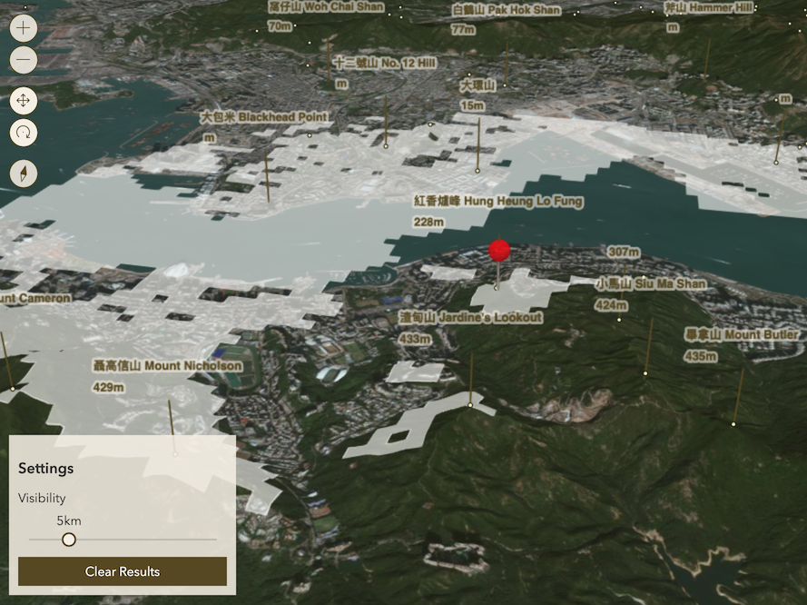

# Peaks of Hong Kong

A web map application for investigating area visible from the peaks of Hong Kong

> How much of the city you can see from the peaks?

This project is an interactive 3d web map for viewers to explore where they can see from the peaks of Hong Kong. The web map calculate the visible area ([viewshed](https://en.wikipedia.org/wiki/Viewshed)) from any point the user clicked on the map.

In addition, the user can select their own visible range when computing the viewshed so as to imitate the visible range during different weather. The current visibility are also available in the webpage for users' reference (data provided by API of Hong Kong Observatory).

---

Overview of the web map
&nbsp;

Example usage of the map to drag and view the topography of the hill, as well as zoom to the designated spots

&nbsp;

Example usage of performing a viewshed analysis, allowing users to view the visible area from the peaks
